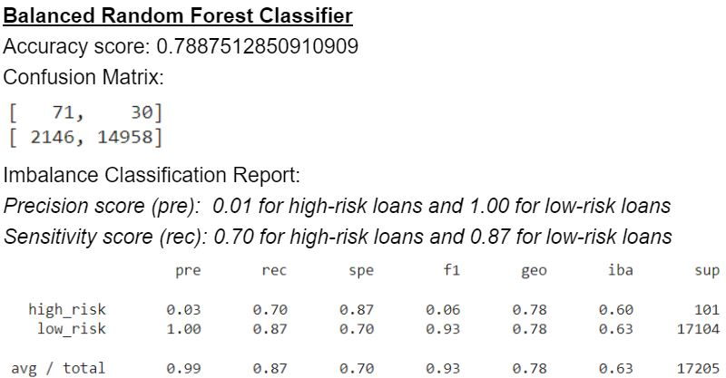
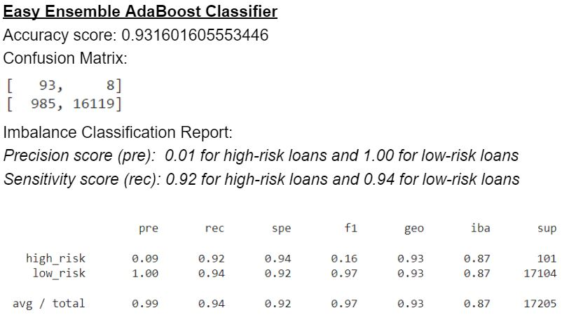

# Credit Risk Analysis

## Overview of the analysis:
We will evaluate various machine learning models for their ability to predict credit risks on loans.  For this analysis, we will use credit card credit dataset from LendingClub, a peer-to-peer lending service company.  

## Results:
Credit risk is an inherently unbalanced risk, meaning in a typical pool of loan, there will only be a small numbers of the loan turns into "high risk" or "bad loans".  We evaluated six machine learning models for their ability to identify as many of these potential bad loans while minimized the false positive. (False Positive: predicting a loan that ultimately turn out to be a good loan as a bad loan) 

Below we listed their performance and analysis:

**Logistic Regression Based Models:**
 
Using four different ways to sample our data in the Logistic Regression model, we find that the Combination (Overand Under) Sampling method gave us the best sensitivity .  In the confusion matrix we can see this model was able to identify 81 of the 101 bad loans while 

**Random Forest Based Models:**
 

## Summary:

