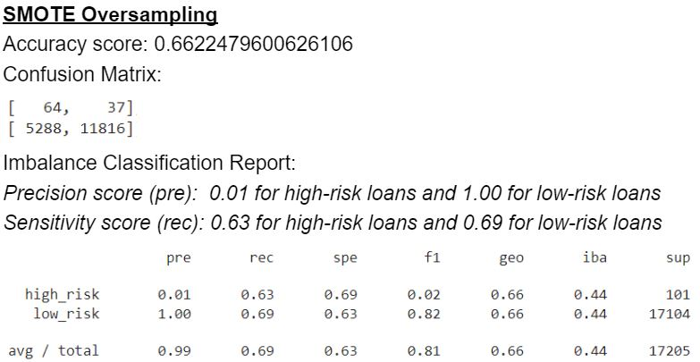
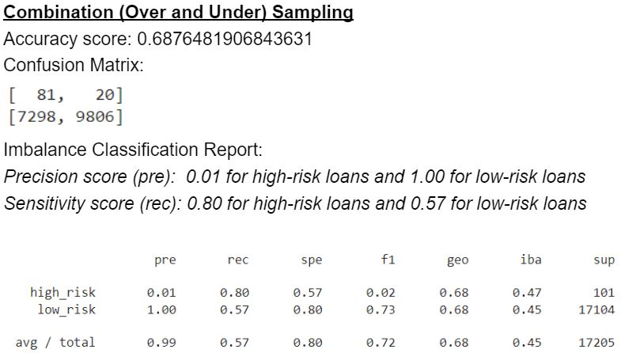

# Credit Risk Analysis

## Overview of the analysis:
We will evaluate various machine learning models for their ability to predict credit risks on loans.  For this analysis, we will use the credit card credit dataset from LendingClub, a peer-to-peer lending service company.  

## Results:
Credit risk is an inherently unbalanced risk, meaning in a typical pool of loans, there will only be a small number of potentially high-risk or bad loans. We evaluated six machine learning models for their ability to identify these potentially high-risk loans while minimizing the misclassification of potentially good loans.

Below we listed their performance and analysis:

**Four Logistic Regression Based Models:** 
Using four different ways to sample our data for the logistic regression model, we found that the Combination (Over and Under) Sampling method gave us the best sensitivity in identifying high-risk loans. In the confusion matrix, we can see the Combination Sampling method identifies the highest percentage of high-risk loans among the four logistic regression based models (81 out of the total 101 high-risk loans).
  
On the other hand, the SMOTE Oversampling method performs the best within the logistic regression model in minimizing the misclassification of low-risk loans as potentially high-risk loans. In the confusion matrix, the SMOTE method has the highest percentage of True Negative (11,816 out of the total of 17,104 low-risk loans)

 

**Other Machine Learning Models:**
 

## Summary:
Since none of the four logistic regression models achieve high sensitivity to both the high and low-risk loans, we can conclude that logistic regression models are not good for identifying credit risk.

We can see both the random forest and the ensemble models perform much better than logistic regression than the four Logistic Regression models. Both models achieve high sensitivity (rec) scores for high and low-risk loans, especially the Easy Ensemble AdaBoosts model.

Based on the performance statistics, **we would recommend the ensemble model for our credit risk analysis**.  In our case, the ensemble model was able to identify 93 of the 101 bad loans while only 985 of the 17,104 good loans were tag for high risk loans.  

